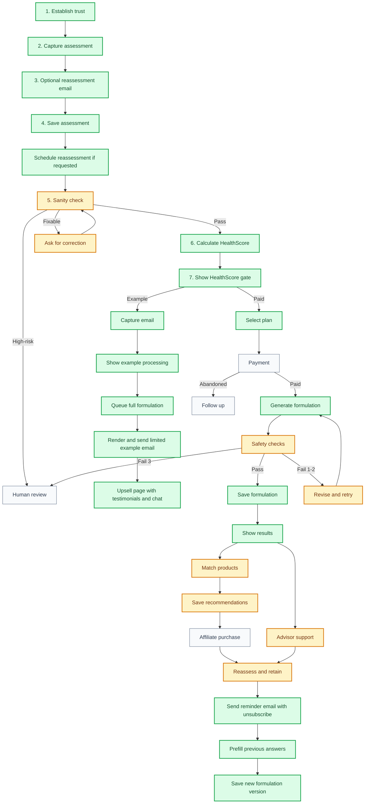
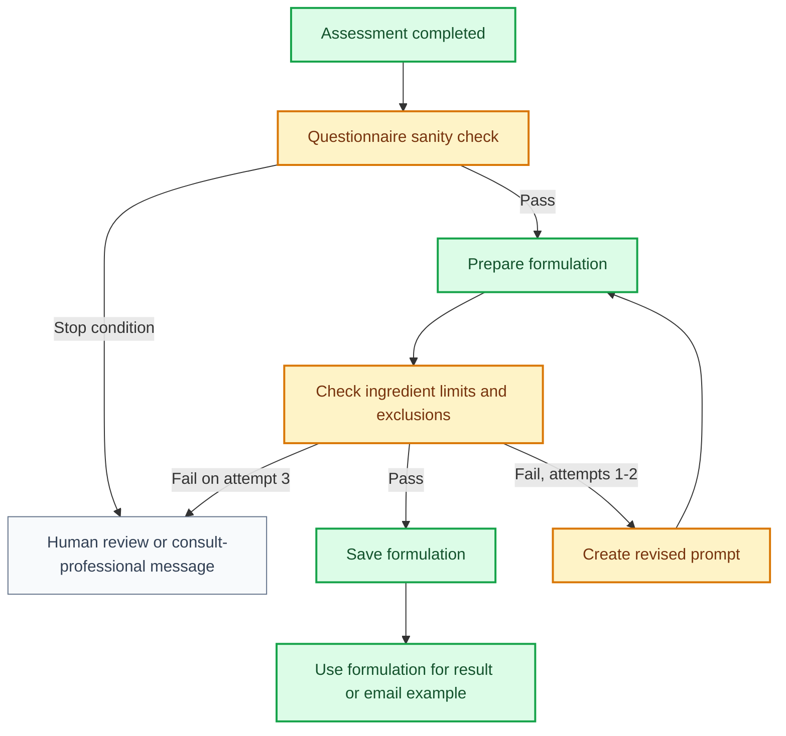

# MattaNutra Business Process Roadmap

This document distils the business process and maps it to the current product state. It intentionally avoids technical vendor choices and implementation detail.

## Status Legend

| Status | Meaning |
| --- | --- |
| Done | Working in the current product |
| In Progress | Partly built or present as a placeholder |
| Pending | Not yet built |
| Decision Needed | Business decision or external dependency required |

## Current State Summary

MattaNutra can capture an anonymous wellness assessment, calculate a HealthScore, show a plan gate, and generate a personalised nutritional formulation from the saved assessment.

The new commercial flow is now:

1. Complete the assessment.
2. Optionally capture an email for a free 60-day reassessment reminder inside the health considerations section.
3. Save the assessment before payment.
4. Calculate and show the HealthScore.
5. Let the user either request a free email example or choose a paid plan.
6. For the free path, request the formulation as a low-priority background job, then continue to the upsell page while the email example is prepared.
7. The upsell page shows email expectation copy, testimonials, and chat connection options tied to the plan where supported.
8. For the paid path, continue processing and show the full formulation page.
9. For reassessment reminders, schedule a recurring 60-day action that emails the user, supports unsubscribe, and invites the user back with the previous plan prefilled.

| Business Area | Current State | Status |
| --- | --- | --- |
| Brand and website | MattaNutra branding, English and Thai pages, legal pages, footer, and navigation exist. | Done |
| Anonymous assessment | Questionnaire captures profile, goals, lifestyle, preferences, and constraints. | Done |
| Reassessment email capture | Optional reassessment email capture appears inside the health considerations section before HealthScore generation. | Done |
| Assessment storage | Assessment answers are saved before payment or plan selection. | Done |
| Questionnaire sanity check | Required fields exist, but formal impossible-value and high-risk handling is not complete. | In Progress |
| HealthScore | HealthScore is calculated from assessment answers before the paywall. | Done |
| HealthScore gate | User sees score context before choosing email example or paid plan. | Done |
| Free example capture | Email can be captured for a free example lead path. | Done |
| Example formulation | The full formulation is queued and prepared for the example path. | Done |
| Example email | A limited HTML email preview is rendered, sent when email delivery is configured, and audited with delivery status and delivery reference. | Done |
| Example upsell page | After example processing, the user sees email expectation copy, testimonial proof, and LINE, Telegram, and WhatsApp connection options. | Done |
| Plan selection | Customer can choose Precision or Pro before full formulation processing. | Done |
| Returning reassessment | A returning plan link can prefill previous answers and create a new formulation version for the same plan. | Done |
| Payment | Plan gate exists, but payment collection is not active. | Pending |
| Full formulation generation | Assessment answers are processed and return a personalised formulation. | Done |
| Formulation storage | Formulation versions are saved before display. | Done |
| Bilingual result display | Formulation fields can be returned and shown in English or Thai. | Done |
| Product recommendations | Result page handles recommendations, but live product matching is not active. | In Progress |
| Recommendation storage | Recommendation versions can be saved. Live matched content is not active. | In Progress |
| Chat support | Chat CTA exists, but live advisor workflow is not fully connected. | In Progress |
| Affiliate purchase journey | Affiliate-led purchase flow is not live. | Pending |
| Safety governance | Disclaimers and legal pages exist; hard dosing, exclusion, and review rules are still needed. | In Progress |
| Follow-up and retention | Recurring reassessment scheduling, email sending, audit logging, unsubscribe handling, and return-link prefill exist. Wider lifecycle messaging is not active. | In Progress |
| Admin and reporting | Operational dashboard and funnel reporting are not active. | Pending |

## Product UX TODOs

- Add an overall progress bar to the processing page so users can see total journey progress, not just the active step list.
- Include nutrition guidance in the formulation output and carry that nutrition context into subsequent advisor conversations.

## Target Customer Journey

```mermaid
flowchart LR
  A["Visitor lands on MattaNutra"] --> B["Completes anonymous assessment"]
  B --> B1["Optional reassessment email captured"]
  B1 --> C["Assessment is saved"]
  C --> C1["Schedule reassessment if email supplied"]
  C1 --> D["Questionnaire sanity check"]
  D -->|Pass| E["HealthScore is calculated"]
  D -->|Fixable issue| F["Ask customer to correct answers"]
  D -->|High-risk| G["Route to human review"]
  F --> D
  E --> H["HealthScore gate"]
  H -->|Free example| I["Capture email"]
  I --> J["Show example processing"]
  J --> K["Queue full formulation"]
  K --> L["Render and send limited example email"]
  L --> L1["Show upsell and chat options"]
  H -->|Paid plan| M["Select Precision or Pro"]
  M --> N["Payment"]
  N -->|Paid| O["Prepare full formulation"]
  N -->|Abandoned| P["Abandoned-payment follow-up"]
  O --> Q["Safety checks"]
  Q -->|Pass| R["Save formulation"]
  Q -->|Fail 1-2| S["Revise formulation request"]
  S --> O
  Q -->|Fail 3| G
  R --> T["Show results"]
  T --> U["Match products"]
  U --> V["Save recommendations"]
  V --> W["Customer buys through affiliate link"]
  T --> X["Customer connects to advisor chat"]
  X --> Y["Ongoing support and refinement"]
  W --> Z["Reassessment and reorder prompts"]
  Z --> ZA["Recurring 60-day reminder"]
  ZA --> Z0["Send reminder email with unsubscribe"]
  Z0 --> ZAA["Return with previous answers prefilled"]
  ZAA --> ZB["Create new formulation version"]

  classDef done fill:#dcfce7,stroke:#16a34a,color:#14532d,stroke-width:2px;
  classDef progress fill:#fef3c7,stroke:#d97706,color:#78350f,stroke-width:2px;
  classDef pending fill:#f8fafc,stroke:#64748b,color:#334155,stroke-width:1px;

  class A,B,B1,C,C1,E,H,I,J,K,L,L1,M,O,R,T,Z0,ZA,ZAA,ZB done;
  class D,F,Q,S,U,V,X,Z progress;
  class G,N,P,W,Y pending;
```

## Business Process Gates

## Process Detail

### 1. Assessment

Purpose: collect enough anonymous information to personalise the formulation and calculate a useful HealthScore.

Current state: built and working. The separate review step has been removed; once the final questionnaire section is complete, the user generates their HealthScore directly.

The assessment captures:

- Profile basics.
- Region.
- Goals.
- Lifestyle and diet.
- Medication and supplement considerations.
- Preferences such as budget and capsule limit.
- Optional precision inputs such as labs, family history, stress, wearable data, and VO2 context.

Next business work:

- Define formal impossible-value checks.
- Define high-risk answers that must stop automation.
- Confirm the customer-facing message when sanity checks fail.

### 2. HealthScore

Purpose: give the user immediate value before the paywall and identify the areas that shape the formulation.

Current state: built. HealthScore is calculated after the assessment is saved and before plan selection.

The HealthScore should show:

- Overall score.
- Score band.
- Six domain scores.
- Short summary of the largest opportunity.
- A few high-impact areas that would most improve the score.

### 3. Free Example Lead Path

Purpose: capture value from users who do not choose a paid plan immediately.

Current state: built. Email capture, example formulation queueing, limited HTML email rendering, email sending, and delivery audit logging are present.

Target process:

1. User enters email on the HealthScore gate.
2. User sees the shared processing page while the free formulation request is queued.
3. The request is stored as a low-priority background job.
4. The user lands on an upsell page explaining that the example is being prepared and should arrive by email.
5. The background worker prepares the full formulation, then renders and sends only the limited example.
6. The upsell page shows testimonial proof and invites the user to connect through LINE, Telegram, or WhatsApp with the plan attached where the channel supports it.
7. The send result is audited with delivery status, recipient, email type, and delivery reference when available.
8. If the user opted into reassessment reminders, the example email includes an unsubscribe link.

The user receives only a limited example, even though the full formulation is processed.

Queue priority: Pro paid jobs run first, then Precision paid jobs, then reassessment jobs, then free example formulation and email jobs.

### 4. Plan and Payment

Purpose: convert the assessment into a paid plan.

Current state: plan selection exists. Payment is not connected.

Planned plans:

| Plan | Business Promise |
| --- | --- |
| Precision Plan | Full personalised formulation and product guidance. |
| Pro Plan | Precision Plan plus ongoing specialist AI advisor support and refinement. |

Next business work:

- Confirm pricing.
- Confirm refund policy.
- Activate payment acceptance.
- Decide what happens if payment fails or is abandoned.
- Use the saved assessment and HealthScore to support respectful follow-up.

### 5. Formulation

Purpose: turn assessment answers into a clear wellness formulation.

Current state: working. The formulation is prepared, saved, versioned, and then rendered on the results page.

The formulation result should remain:

- Concise.
- Bilingual.
- Tied to the saved assessment.
- Safe in tone.
- Free of disease-treatment claims.
- Saved before it is displayed or used in an email example.

### 6. Safety and Compliance

Purpose: keep the service in the wellness category and reduce avoidable risk.

Current state: legal pages and disclaimers exist. Hard safety rules are still needed.

### 7. Product Matching

Purpose: translate the formulation into trustworthy products the customer can buy.

Current state: the result page can gracefully show no recommendations. Live matching is not active.

Target process:

1. Maintain a curated list of trusted products.
2. Match products to formulation ingredients.
3. Prefer fewer products when one product covers multiple ingredients.
4. Save the matched recommendation set.
5. Show clear product rationale.
6. Send the customer to marketplace purchase links.

### 8. Advisor Support

Purpose: give customers a way to continue the conversation after receiving their plan.

Current state: advisor CTA exists. The live chat workflow is not complete.

Target process:

- Customer opens preferred chat channel.
- Customer shares their plan reference.
- Advisor retrieves the customer’s plan.
- Advisor helps refine timing, routine, travel, diet, and practical use.

### 9. Retention and Operations

Purpose: turn a one-time formulation into an ongoing relationship.

Current state: partly active. The assessment can capture a reassessment email, schedule a recurring 60-day reminder action, render and send a branded reminder email, audit the rendered output and delivery result, provide an unsubscribe link that cancels the cron action, and prefill the questionnaire when the user returns with the plan link. Broader lifecycle messaging and reporting are not active.

Target process:

- Capture optional reassessment consent before plan selection.
- Schedule a recurring 60-day reminder against the plan.
- Keep one active reassessment reminder per email address and gracefully cancel duplicates.
- Convert due reminder actions into jobs.
- Render, audit, and send a branded email with a reassessment link.
- Include an unsubscribe link that cancels future reassessment reminders.
- Prefill prior answers when the user returns.
- Save the reassessment as a new version of the same plan.
- Bypass the paywall for active Pro members and show a direct continue action.
- Follow up after example request, plan purchase, and product purchase.
- Support reorder decisions.
- Track conversion and retention metrics.

## Current MVP Gap Map

| Gap | Why It Matters | Suggested Priority |
| --- | --- | --- |
| Questionnaire sanity checks | Prevents unusable or risky automated results. | High |
| Payment activation | Required for paid conversion. | High |
| Safety stop rules | Required before scaling traffic. | High |
| Product whitelist | Required for trustworthy recommendations. | High |
| Affiliate approval and link setup | Required for marketplace revenue. | High |
| Qualified reviewer | Reduces compliance and trust risk. | High |
| Live chat workflow | Needed for Pro Plan value. | Medium |
| Email deliverability monitoring | Needed to watch bounces, spam placement, and email delivery failures after launch. | Medium |
| Wider follow-up and reassessment | Needed for retention and repeat use beyond the first 60-day reminder. | Medium |
| Business funnel events | Needed for marketing and conversion optimisation. | Medium |
| Admin reporting | Needed once traffic begins. | Medium |
| Blog section | Needed for acquisition, trust, and explainability content. | Medium |

## Recommended Next Sequence

1. Finish plan model and flow cleanup.
2. Add questionnaire sanity checks and failure handling.
3. Connect payment.
4. Add safety stop rules and ingredient exclusion rules.
5. Build the first trusted product list.
6. Connect product matching to the result page.
7. Make advisor chat work for one channel first.
8. Add email deliverability monitoring.
9. Add blog section and early educational content.
10. Add business funnel events and basic operational reporting.
11. Add broader follow-up and lifecycle messaging.

## Open Business Decisions

| Decision | Needed Because |
| --- | --- |
| Final pricing for Precision and Pro | Required before payment launch. |
| Free example content depth | Defines how much value is given away before payment. |
| Email follow-up cadence | Determines how leads are nurtured. |
| First product category scope | Keeps product matching manageable. |
| Qualified reviewer | Needed for formulation logic and claim review. |
| Support promise for Pro | Defines what customers are buying. |
| Stop-condition policy | Defines when MattaNutra should not generate a plan. |

## One-Line Business Process

MattaNutra captures an anonymous wellness assessment, calculates a useful HealthScore, converts the user through either a paid plan or limited email example, and turns the saved assessment into a personalised nutritional formulation with future product matching and advisor support.
