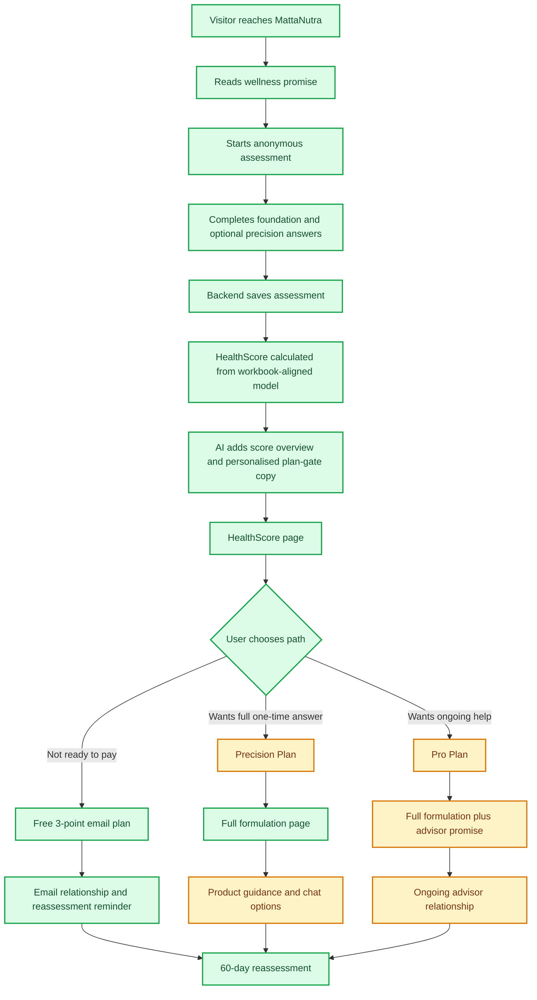
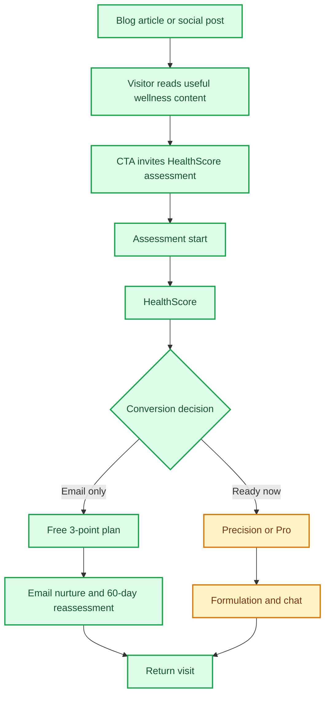

# MattaNutra Business Blueprint

This document explains the current MattaNutra business flows in plain business language. It focuses on how visitors become leads, customers, repeat users, and potential long-term advisor clients.

## Status Legend

| Status | Meaning |
| --- | --- |
| Done | Working in the current product |
| Partial | Built, but incomplete, manually dependent, or not yet proven commercially |
| Not Done | Not yet live |

## Business Model in One Line

MattaNutra uses an anonymous wellness assessment and HealthScore to earn trust, then converts users into either a free email lead, a one-time Precision Plan buyer, or an ongoing Pro advisor customer.

## Offer Ladder

| Offer | Customer Type | Business Purpose | Current Status |
| --- | --- | --- | --- |
| Free HealthScore | Curious visitor | Create trust and show personal relevance | Done |
| Free 3-point email plan | Skeptical lead | Capture email and nurture toward purchase | Done |
| Precision Plan | One-time buyer | Sell a complete personalised nutritional formulation | Partial: plan exists, payment not live |
| Pro Plan | Ongoing customer | Sell continuing AI advisor support and reassessment | Partial: offer exists, advisor workflow not fully live |
| Product guidance | Buyer ready to act | Support marketplace or affiliate revenue | Partial: results section exists, live matching not active |
| Blog and testimonials | Marketing audience | Generate awareness, trust, and organic/social traffic | Partial: platform and APIs exist, content cadence not proven |

## Current Funnel

## What Works Now

- The assessment can be completed anonymously without requiring name, phone, or address.
- The HealthScore is generated on the backend and aligned to the business scoring workbook.
- The HealthScore page now gives a score, domain snapshot, radar chart, and AI-written overview.
- The plan gate can adapt its sales copy and three feature cards to the user profile.
- The free email route captures a lead and can schedule recurring 60-day reassessment reminders.
- SMTP email sending is wired in, including audit logging and unsubscribe handling.
- The formulation page can display stored formulation data from the backend.
- Blog posts and testimonials are database-driven.
- Blog/testimonial/attestation management APIs are protected by `ADMIN_TOKEN` for OpenClaw or another admin system.
- English and Thai flows exist.

## What Still Needs Work

| Area | Why It Matters | Status |
| --- | --- | --- |
| Payment | Revenue cannot be measured until users can pay | Not Done |
| Product matching | Affiliate revenue depends on trusted product guidance | Partial |
| Advisor chat handoff | Pro only works if the advisor can retrieve and use the plan context | Partial |
| LINE deep link | Thai users are likely to prefer LINE, but plan handoff is not seamless | Partial |
| Safety checks | Wellness trust depends on clear stop conditions and exclusions | Partial |
| Funnel analytics | The business needs event data to optimize conversion | Not Done |
| Content distribution | Blog infrastructure exists, but repeatable publishing and social distribution are not proven | Partial |
| Paid reassessment contact | Paid users need a reliable email path if they do not use the free email option | Partial |

## Sales Funnel by Path

### Free Path

Business goal: capture skeptical users without forcing payment.

Current customer promise:

- Complete the assessment.
- Receive a HealthScore.
- Enter email to receive a free 3-point nutrition plan.
- Optionally receive a free 60-day reassessment reminder.

What is good:

- Low-risk and generous enough to keep hesitant users in the funnel.
- Email capture creates a relationship even when the user does not buy.
- The 60-day reassessment creates a reason to return.

Remaining concerns:

- The business must keep the free plan useful, but not so complete that Precision loses value.
- The post-free-email page still needs a clearer business purpose: upgrade, chat, education, testimonial proof, or all of these.
- Follow-up after the first email is still light.

### Precision Plan

Business goal: convert users who want a complete one-time plan.

Current customer promise:

- Unlock the full personalised nutritional formulation.
- Get more complete dose logic, timing, benefits, and product guidance.
- Use the plan without subscribing.

What is good:

- Strong fit for medium-budget, skeptical customers.
- Easy to understand as a one-time product.
- Full formulation is already a meaningful deliverable.

Remaining concerns:

- Payment is not live.
- Product guidance needs stronger trust signals before it can drive affiliate behavior.
- The difference between the free email and Precision must be very clear.

### Pro Plan

Business goal: create recurring revenue through an ongoing specialist AI supplement advisor.

Current customer promise:

- Everything in Precision.
- Ongoing support and refinement through chat.
- Help adapting the plan to day-to-day needs.

What is good:

- The strategic idea is strong: the user does not just get a static list.
- Chat fits the Thai/mobile-first customer behavior.
- Reassessment creates natural recurring value.

Remaining concerns:

- The Pro promise needs more concrete use cases: travel, poor sleep, changed training, meals out, new lab results.
- The advisor must clearly know the user's plan and HealthScore.
- LINE, WhatsApp, and Telegram handoffs should be made reliable, starting with one best channel.

## Marketing Capture Flow

The blog is not only educational. It is the top of the marketing engine. Articles should answer common wellness questions, build credibility, and direct readers into the assessment.

## Most Important Business Decisions

1. Activate the payment path and decide which local payment methods matter most.
2. Define the exact free plan boundary: what the user gets and what stays paid.
3. Decide the strongest first Pro use cases.
4. Choose one chat channel to make excellent before polishing all three.
5. Define product trust criteria before leaning hard into affiliate revenue.
6. Add funnel analytics so decisions are based on behavior rather than opinion.
7. Decide what the post-free-email page should do next.

## Suggested Next Commercial Priorities

| Priority | Work | Reason |
| --- | --- | --- |
| 1 | Payment activation | Revenue testing is blocked until this works |
| 2 | Funnel event tracking | The business needs to see where users drop |
| 3 | Free email follow-up sequence | Captured leads need nurturing |
| 4 | Product trust and matching | Needed for affiliate upside |
| 5 | Pro advisor handoff | Needed to justify subscription |
| 6 | Blog/social cadence | Needed to feed the funnel without relying only on paid traffic |

## Core Business Narrative

MattaNutra should feel like the start of a relationship, not a supplement checkout. The product earns trust with an anonymous HealthScore, shows a practical next step, then lets the customer choose how much guidance they want: free preview, full one-time plan, or ongoing advisor support.
