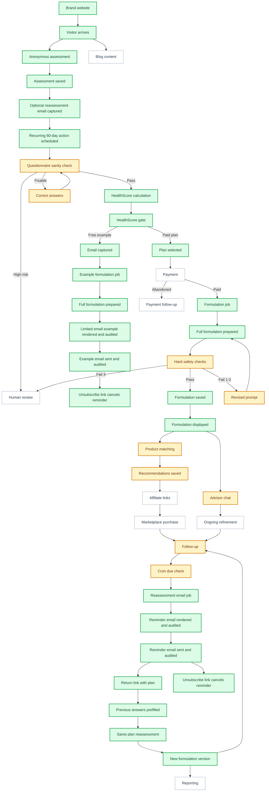

```mermaid
flowchart TB
  A["Brand website"] --> B["Visitor arrives"]
  B --> C["Anonymous assessment"]
  C --> D["Assessment saved"]
  D --> D1["Optional reassessment email captured"]
  D1 --> D2["Recurring 60-day action scheduled"]
  D2 --> E["Questionnaire sanity check"]
  E -->|Pass| F["HealthScore calculation"]
  E -->|Fixable| G["Correct answers"]
  G --> E
  E -->|High-risk| H["Human review"]
  F --> I["HealthScore gate"]
  I -->|Free example| J["Email captured"]
  J --> K["Example formulation job"]
  K --> L["Full formulation prepared"]
  L --> M["Limited email example rendered and audited"]
  M --> N["Example email sent and audited"]
  N --> N1["Unsubscribe link cancels reminder"]
  I -->|Paid plan| O["Plan selected"]
  O --> P["Payment"]
  P -->|Paid| Q["Formulation job"]
  P -->|Abandoned| R["Payment follow-up"]
  Q --> S["Full formulation prepared"]
  S --> T["Hard safety checks"]
  T -->|Pass| U["Formulation saved"]
  T -->|Fail 1-2| V["Revised prompt"]
  V --> S
  T -->|Fail 3| H
  U --> W["Formulation displayed"]
  W --> X["Product matching"]
  X --> Y["Recommendations saved"]
  Y --> Z["Affiliate links"]
  Z --> AA["Marketplace purchase"]
  W --> AB["Advisor chat"]
  AB --> AC["Ongoing refinement"]
  AA --> AD["Follow-up"]
  AC --> AD
  AD --> AE["Cron due check"]
  AE --> AF["Reassessment email job"]
  AF --> AG["Reminder email rendered and audited"]
  AG --> AH["Reminder email sent and audited"]
  AH --> AI["Return link with plan"]
  AH --> AO["Unsubscribe link cancels reminder"]
  AI --> AJ["Previous answers prefilled"]
  AJ --> AK["Same plan reassessment"]
  AK --> AL["New formulation version"]
  AL --> AD
  AL --> AM["Reporting"]
  B --> AN["Blog content"]

  classDef done fill:#dcfce7,stroke:#16a34a,color:#14532d,stroke-width:2px;
  classDef partial fill:#fef3c7,stroke:#d97706,color:#78350f,stroke-width:2px;
  classDef todo fill:#ffffff,stroke:#94a3b8,color:#334155,stroke-width:1px;

  class A,B,C,D,D1,D2,F,I,J,K,L,M,N,N1,O,Q,S,U,W,AF,AG,AH,AI,AJ,AK,AL,AO done;
  class E,G,T,V,X,Y,AB,AD,AE partial;
  class H,P,R,Z,AA,AC,AM,AN todo;
```
