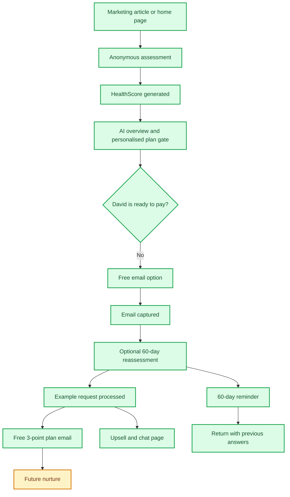
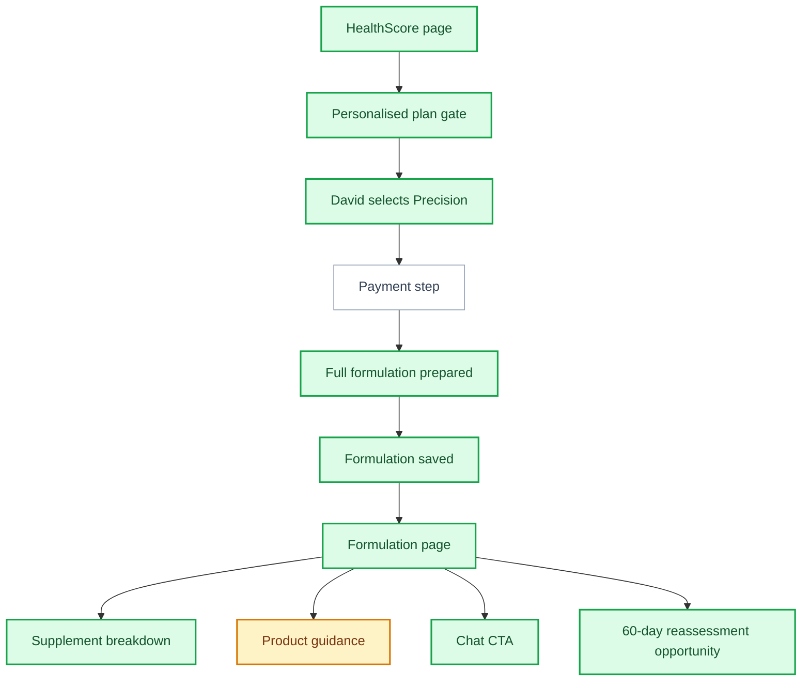
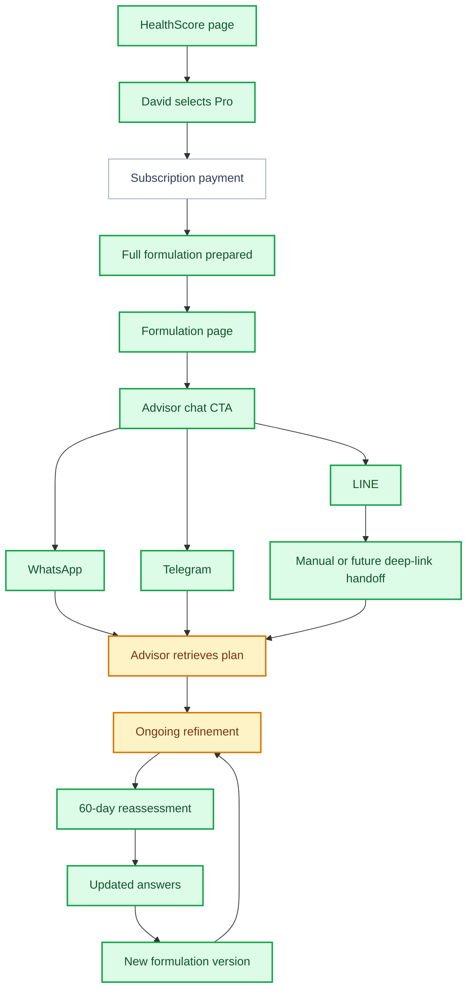
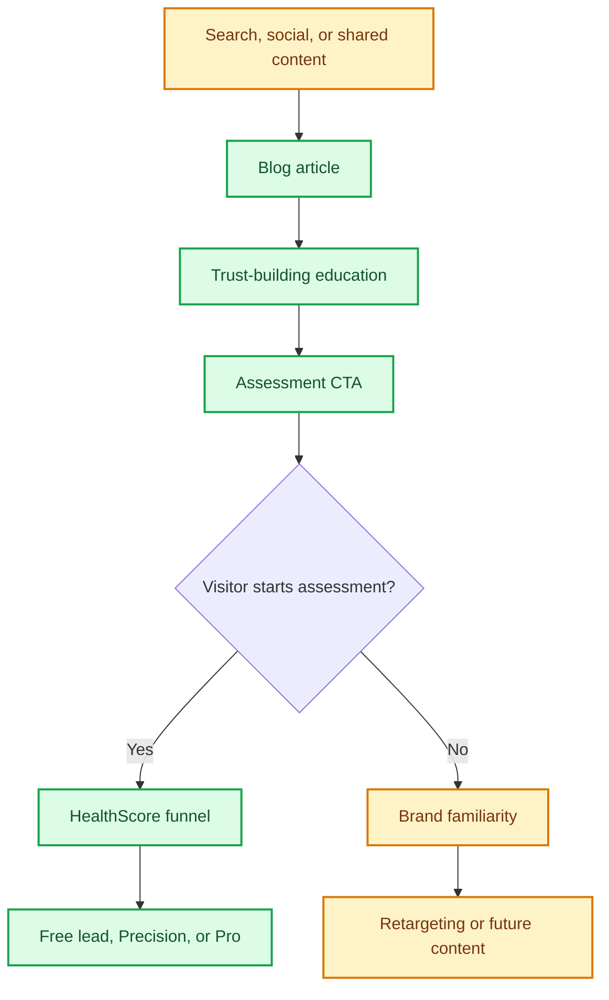
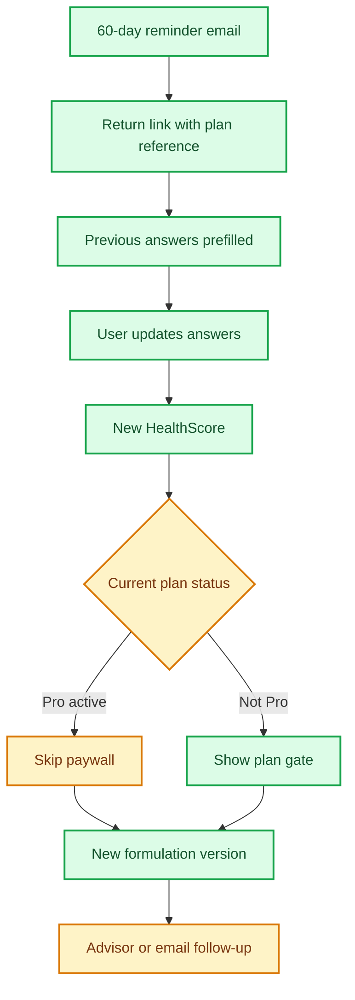

# MattaNutra Narrated User Journeys

This document describes the main customer journeys through MattaNutra in story form. It is written for business review: what the user wants, what they experience, what is working, and where the funnel can be improved.

## Status Legend

| Status | Meaning |
| --- | --- |
| Done | Working in the current product |
| Partial | Built, but incomplete or not yet proven |
| Not Done | Not yet live |

## Primary Persona

David is 52, lives in Thailand, works long hours, exercises sometimes, and wants better energy and longevity. He has a medium budget but is skeptical about supplements. He does not want a generic pill list. He wants to know whether MattaNutra can understand his situation and save him wasted research, money, and guesswork.

David's emotional journey is simple:

1. "Is this credible?"
2. "Will this understand me?"
3. "Is the result useful?"
4. "Is the paid plan worth it?"
5. "Can I act on this without feeling overwhelmed?"

## Journey 1: Free Lead Capture

### User Intent

David is interested but not ready to pay. He wants proof first.

### Narrated Journey

David lands on MattaNutra from a blog article or shared link. The promise is personal wellness guidance, not a generic supplement quiz. He starts the anonymous assessment because it feels low-risk and does not ask for his name, phone, or address.

He completes the foundation questions and may add optional precision details if he is motivated. The system saves the assessment and generates his backend HealthScore. The score page gives him a clear number, a six-domain snapshot, and a short AI-written overview of what his answers suggest.

At the plan gate, David sees "Your HealthScore is ready". The supporting copy and feature cards are adapted to his profile. He is still skeptical, so he chooses the free 3-point nutrition plan by email. He enters an email address and can opt into a free 60-day reassessment.

The system processes the request, prepares the formulation in the background, and sends only the top three most useful supplement suggestions as a free preview. David then sees an exit or upsell page with reassurance, testimonial proof, and chat options.

### Flow

### What Is Good

- The free route catches users who would otherwise leave.
- The HealthScore gives David value before asking for payment.
- The email opt-in feels natural because he has just seen a personal result.
- The 60-day reassessment creates a reason to return.

### Gaps and Improvements

- The free email must feel useful enough to build trust, but clearly incomplete compared with Precision.
- The post-free-email page needs a sharper purpose. It should probably focus on one primary next action: upgrade, chat, or read a practical article.
- Follow-up should become a sequence, not just one reminder.
- The business should measure whether free users later buy Precision or Pro.

## Journey 2: Precision Plan

### User Intent

David wants a complete one-time plan. He does not want a subscription yet.

### Narrated Journey

David completes the same assessment and sees the same HealthScore moment. This time, the score overview and personalised plan-gate features convince him that the system has understood his priorities.

He chooses Precision because he wants the full formulation and practical product guidance without ongoing support. The product should feel like a paid brief: clear, specific, and useful enough to save him research time.

After the plan is selected, the formulation is prepared and saved. David lands on the formulation page, where he can review his assessment summary, supplement breakdown, dose information, benefits, and product recommendation area. He can also connect with the AI advisor through chat, although that is not yet the main reason he bought Precision.

### Flow

### What Is Good

- Precision is easy to understand as a one-time purchase.
- It is a strong match for skeptical but interested users.
- The formulation page is already a substantial deliverable.
- The HealthScore and AI-written plan-gate copy help bridge from free value to paid value.

### Gaps and Improvements

- Payment is not live, so real conversion cannot yet be tested.
- Product guidance needs stronger quality proof: coverage, form, quality criteria, and value.
- If paid users do not provide email, reassessment follow-up may be unreliable.
- The Precision plan should make the paid unlock unmistakable: full formulation, dose logic, timing, cautions, and product guidance.

## Journey 3: Pro or Premium Plan

### User Intent

David wants help applying the plan in real life. He wants the advisor to adapt to changing sleep, food, travel, training, and budget.

### Narrated Journey

David selects Pro because he wants more than a static formulation. He expects the service to help him decide what to do day by day. The Pro promise should feel like a specialist advisor who already knows his HealthScore and formulation.

After the formulation is prepared, the result page invites him to connect with the AI supplement advisor through LINE, WhatsApp, or Telegram. The ideal experience is that David opens chat and the advisor already knows his plan. In the current product, WhatsApp and Telegram can carry the plan more directly when configured correctly; LINE may still require a manual plan handoff unless deeper linking is added.

Over time, Pro should support reassessment and plan versions. David returns after 60 days, sees how his HealthScore has moved, updates his answers, and receives a refined formulation.

### Flow

### What Is Good

- Pro has a strong strategic role: make the plan living rather than static.
- Chat is a natural customer behavior, especially in Thailand.
- Reassessment and plan versions give Pro a reason to exist beyond the first formulation.

### Gaps and Improvements

- Subscription payment is not live.
- The advisor experience needs a stronger first-run moment.
- The business should define concrete Pro use cases:
  - "I slept badly, what should I adjust today?"
  - "I am travelling this week, what should I prioritise?"
  - "I changed my training schedule, does my plan change?"
  - "I have new lab results, what matters?"
- One chat channel should be made excellent before trying to perfect all of them.

## Journey 4: Marketing Capture Through Blog and Social

### User Intent

David is not looking for MattaNutra yet. He is reading about sleep, longevity, supplement confusion, budget, or whether supplements are worth it.

### Narrated Journey

David sees a MattaNutra article or social post. The content answers a real question without sounding like a hard sell. At the bottom of the article, a CTA invites him to take a few minutes to discover his HealthScore and start a more personal conversation.

If he starts the assessment, the marketing visitor becomes either a lead, a Precision buyer, or a Pro prospect. If he does not start, the article still builds brand familiarity.

OpenClaw or another content system can eventually publish blog posts, testimonials, and social content into this funnel using the protected admin API.

### Flow

### What Is Good

- Blog and testimonial infrastructure exists.
- Articles can now link naturally into the assessment.
- Admin endpoints are protected for external publishing systems.
- This reduces dependency on direct landing-page traffic.

### Gaps and Improvements

- The business needs a content calendar.
- Each article should map to a specific assessment motivation.
- Testimonials should be selected to answer the customer's likely objection.
- OpenClaw publishing is possible structurally, but content operations are not yet proven.

## Journey 5: Returning Reassessment User

### User Intent

David wants to know whether anything changed and whether his plan should be refined.

### Narrated Journey

David receives a 60-day reassessment email. The email frames the return around movement: his HealthScore can change as sleep, food, training, stress, and data change. He clicks the link and returns to the assessment with his previous answers prefilled.

He updates anything that changed. The platform keeps the same plan relationship and can create a new version of the plan rather than treating him as a brand-new person. If he is a Pro user, the paywall can be skipped once active access is known. If he is not, the business can decide whether reassessment is free, paid, or an upgrade moment.

### Flow

### What Is Good

- Reassessment gives the product a reason to exist after the first visit.
- Prefilled answers reduce friction.
- New plan versions support the idea that wellness changes over time.

### Gaps and Improvements

- The business must decide whether reassessment is a free service, a paid feature, or a Pro benefit.
- Score movement should be shown clearly: what improved, what worsened, and what changed in the recommendation.
- Reassessment messaging should feel like service, not a generic marketing reminder.

## Cross-Journey Strengths

- Anonymous positioning lowers resistance.
- The HealthScore is a strong bridge between education and purchase.
- AI-personalised copy at the plan gate can make the funnel feel more relevant.
- Free, Precision, and Pro give users different commitment levels.
- Reassessment turns a one-time assessment into an ongoing relationship.

## Cross-Journey Weaknesses

- Payment is the biggest blocker to learning real conversion behavior.
- Product recommendations need stronger trust before affiliate revenue can be relied on.
- The advisor promise needs operational definition.
- Safety and sanity checks should be tightened before heavier traffic.
- Funnel analytics are needed so business decisions are based on behavior.

## Recommended Experience Improvements

1. Make the HealthScore overview the emotional bridge: "This is what matters most for you."
2. Make each plan level answer a simple question:
   - Free: "What are my first three useful steps?"
   - Precision: "What exactly should I do and buy?"
   - Pro: "How do I adapt this day to day?"
3. Make product guidance visibly quality-led, not affiliate-led.
4. Add a clearer post-free-email destination.
5. Build one excellent chat handoff before expanding all chat channels.
6. Add funnel metrics for start, completion, free email, paid selection, result view, chat click, product click, and 60-day return.
